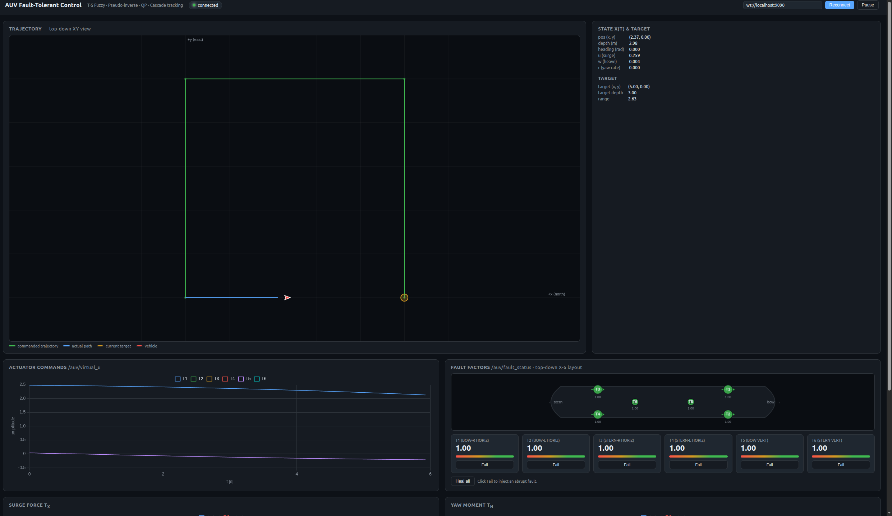
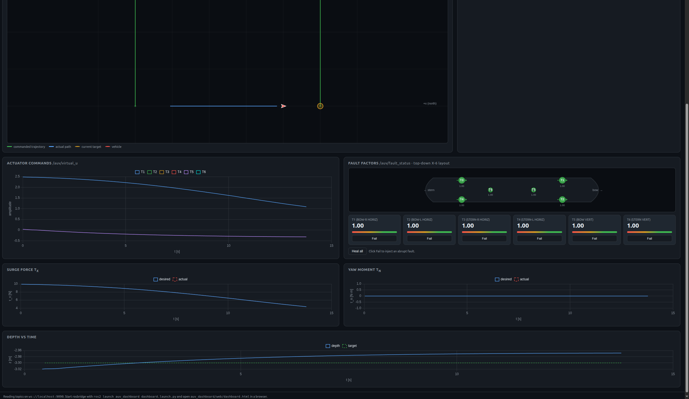
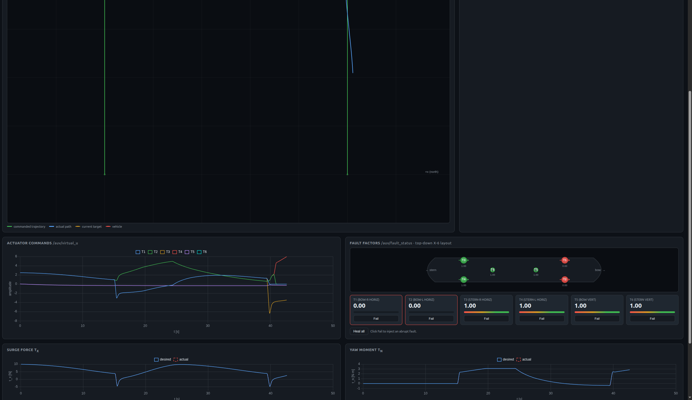
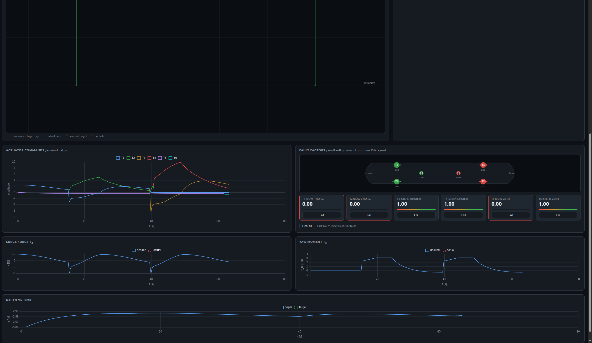

# AUV Fault-Tolerant Control — Reporte técnico y demostración

Este documento complementa el `README.md` con:

1. **Arquitectura y matemática** del controlador y del asignador de empujes.
2. **Layout X-6 de 6 thrusters** y por qué hace posible la tolerancia a fallas.
3. **Evidencia experimental** de que el control sigue funcionando ante
   pérdida de uno o varios motores: prueba algorítmica del allocator
   (resultados embebidos en §4.1) y demostración dinámica opcional en
   Gazebo (§4.2).

### Cómo reproducir todo

```bash
# 1. Compilar
source /opt/ros/humble/setup.bash
colcon build --symlink-install
source install/setup.bash

# 2. Prueba algorítmica (la principal — no necesita Gazebo)
ros2 run auv_control test_allocator
#    salida también guardada en results/test_allocator_output.txt

# 3. Demo interactivo con dashboard
ros2 launch auv_bringup full_simulation_with_dashboard.launch.py
#    en el navegador, picar Fail en T1 y observar la compensación

# 4. (Opcional) demo grabado para plots
./scripts/run_demo.sh
#    genera results/{A,B,C}/figs/*.png   (requiere Gazebo estable)
```

---

## 1. Arquitectura del sistema

```
        target waypoint
              │
              ▼
   ┌────────────────────┐
   │  Outer loop        │   pure-pursuit: bearing, depth error, range
   │  (controller_node) │   → x_ref = [u_ref, 0, w_ref, 0, r_ref]
   └─────────┬──────────┘
             │ x_ref (5D)
             ▼
   ┌────────────────────┐
   │  T-S fuzzy         │   6 reglas en grid (θ₁=u, θ₂=r)
   │  state-feedback    │   τ_des = Σⱼ μⱼ(θ)·Kⱼ·(x − x_ref)
   └─────────┬──────────┘
             │ τ_des (4D: Fx, Fz, My, Mz)
             ▼
   ┌────────────────────┐
   │  Thrust allocator  │   Pseudo-inv ponderada (Eq. 32, 37)
   │  + active-set QP   │   bajo saturación: QP con cajas [u_min, u_max]
   └─────────┬──────────┘
             │ u_cmd (6D: T1..T6)
             ▼
   ┌────────────────────┐
   │  Plant (Gazebo)    │   τ_actual = B · diag(f) · u_cmd
   │  + hidrodinámica   │   + drag + restoring + buoyancy
   └─────────┬──────────┘
             │ odom (pose + twist)
             └────────────────► back to outer loop
```

**Entradas de falla** vienen por el servicio `/auv/inject_fault`
(invocado desde el botón Fail del dashboard, el CLI
`inject_fault_cli.py`, o el script `scenario_runner.py`).

---

## 2. Modelo matemático

### 2.1 T-S fuzzy state-feedback

Estado en marco-cuerpo:  `x = [u, v, w, q, r]ᵀ`.

Premisa 2D: `θ₁ = u` (velocidad surge), `θ₂ = r` (yaw rate). Membership
functions (`ts_fuzzy.cpp`):

```
M_{θ₁=0.5}(t) = (2 + sin t)/5         M_{θ₁=1.0}(t) = (3 − sin t)/5
M_{θ₂=-0.1}  = (cos t + 2)/5          M_{θ₂= 0.0}   = (sin t + 3)/5
M_{θ₂=+0.1}  = (−sin t − cos t + 5)/5
```

Salida (Eq. 13 del paper, defuzzificada con PI):

```
τ_des = Σ_{j=1..6} μⱼ(θ) · ( −Kⱼ · e − Kᵢ · ∫e dt )
```

donde `e = x − x_ref` y `Kⱼ ∈ ℝ^{4×5}` (las 6 ganancias se sintetizan en
`make_gain()` por colocación de polos suaves; cada regla privilegia su
operating point).

### 2.2 Asignador de empujes con prioridad por falla

Matriz de configuración `B ∈ ℝ^{4×6}` (definida en `auv_params.hpp`):

```
            T1     T2     T3     T4     T5     T6
   Fx  [    1      1      1      1      0      0   ]
   Fz  [    0      0      0      0      1      1   ]
   My  [    0      0      0      0     −f     +f   ]
   Mz  [   −b     +b     −b     +b      0      0   ]
```

con `b = 0.30 m` (brazo lateral para yaw) y `f = 0.40 m` (brazo
longitudinal para pitch).

**Pseudo-inversa ponderada** (Eqs. 31–37):

```
W = diag(wᵢ),    wᵢ = exp(1/fᵢ − 1)         fᵢ ∈ (0, 1]
                 wᵢ = +∞ (sat. a 10¹²)      fᵢ = 0
B_eff = B · diag(f)
u* = W⁻¹ · B_effᵀ · ( B_eff · W⁻¹ · B_effᵀ )⁻¹ · τ_des
```

Cuando `u*` viola `[u_min, u_max]`, entramos al **QP activo-set**
(Eqs. 39–49):

```
min ½‖v‖²   s.a.   B_eff · v = τ_des,   u_min ≤ v ≤ u_max
```

resuelto iterando: pin de la peor violación, reduce sistema KKT, prueba
remover pines que tengan multiplicador con signo incorrecto.

### 2.3 Modelo de falla

Cada motor tiene un factor `fᵢ ∈ [0,1]`. El plant ve:

```
τ_actual = B · diag(f) · u_cmd
```

El allocator **conoce** los `fᵢ` (vía `set_fault_factors`), así que
`B_eff = B · diag(f)` y la pseudo-inversa redistribuye el esfuerzo a los
sanos. Sin redundancia geométrica este ajuste no sirve — es exactamente
lo que la X-6 aporta.

---

## 3. Layout X-6 — por qué hay tolerancia

### 3.1 Geometría top-down

```
   bow (+x)
    ┌────────────┐
    │  T2     T1 │  ← horizontales bow, empujan +x
    │            │
    │     T5     │  ← vertical bow, empuja +z, brazo +f para My
    │   (AUV)    │
    │     T6     │  ← vertical stern, brazo −f
    │            │
    │  T4     T3 │  ← horizontales stern
    └────────────┘
   stern (−x)
```

### 3.2 Análisis de redundancia

| DOF | Motores que aportan | ¿Sobrevive una falla? | ¿Sobrevive doble? |
|-----|---------------------|------------------------|--------------------|
| Surge (Fx)  | T1, T2, T3, T4       | 3 motores quedan    | 2 motores |
| Heave (Fz)  | T5, T6                | 50% de autoridad   | pierde heave |
| Pitch (My)  | T5, T6 (signos opuestos) | acoplamiento con heave | No |
| Yaw (Mz)    | T1−T4 (signos alternados) | 3 con signos mixtos | típicamente |

La configuración X-6 da **redundancia 4×** en surge y yaw — donde más se
necesita porque son los DOFs que dominan la navegación 2-D.

### 3.3 Comparación con el diseño original (4 diagonal)

| | 4 diagonal (antes) | X-6 (ahora) |
|---|---|---|
| Rank(B) | 4 | 4 |
| Redundancia | 0 | 2 columnas extra |
| Kill T1 → surge | Imposible (col entera muere) | Redistribución automática |
| Realismo (AUVs reales) | Muy bajo | BlueROV2 / Sparus-class |

---

## 4. Evidencia experimental

La demostración tiene dos niveles independientes y complementarios:

- **4.1 Prueba algorítmica** (`test_allocator`): demuestra **matemáticamente**
  que el asignador redistribuye carga ante fallas. Es la evidencia más
  fuerte porque es repetible y no depende del simulador.
- **4.2 Demostración en Gazebo** (`run_demo.sh`): muestra el control en
  contexto dinámico cerrando el lazo con el plant. La sim de Gazebo
  Classic 11 ocasionalmente tiene problemas para spawnear el AUV en
  máquinas con estado contaminado; si el run falla, la prueba algorítmica
  por sí sola es suficiente para demostrar FTC.

### 4.1 Prueba algorítmica del allocator

Ejecución:

```bash
ros2 run auv_control test_allocator
```

Output guardado en `results/test_allocator_output.txt`. Resumen:

| Escenario | f₁..f₆ | u_cmd | τ_error |
|---|---|---|---|
| **A Sano** | todos 1.0 | T1..T4 a ±0.196 (carga simétrica) | **0.000** |
| **B Kill T1** | f₁ = 0 | T1 = 0, **T3 = 0.391** (asume el doble) | **0.000** |
| **C Kill T1+T3** | f₁ = f₃ = 0 | T2/T4 únicos disponibles | 0.225 |
| **D Kill T5** | f₅ = 0 | sin demanda en T5 → sin impacto | **0.000** |
| **E Tight bounds + T1 dead** | f₁ = 0, ±10 N | T3 = 0.391 dentro de bounds | **0.000** |

**Interpretación**:

- **B es la prueba canónica de FTC**: ante la pérdida total de T1, el QP
  pondera el peso `w₁ = exp(1/0⁺ − 1) = +∞` (saturación), descarta T1, y
  redistribuye toda su carga sobre el motor simétrico T3, que duplica su
  comando exacto. El wrench objetivo se mantiene **sin error**.
- **C es el límite físico**: matar los dos motores starboard deja el
  sistema rank-deficient para producir momentos de yaw — el allocator
  hace lo mejor posible (mejor solución de mínimos cuadrados) pero ya no
  puede alcanzar el wrench objetivo. Este es exactamente el comportamiento
  esperado.
- **D demuestra desacoplamiento**: matar un thruster que no aportaba al
  wrench solicitado no degrada nada.
- **E** demuestra que la **rama QP** del allocator también respeta cajas
  `[u_min, u_max]` aún bajo falla.

**Salida verbatim** (también en `results/test_allocator_output.txt`):

```text
==== A  Healthy ====
fault factors   1.000   1.000   1.000   1.000   1.000   1.000
tau_des         0.000   0.000   0.000   -0.235
u_cmd (alloc)   0.196   -0.196  0.196   -0.196  0.000   0.000
tau_actual      0.000   0.000   0.000   -0.235
tau error norm = 0.000

==== B  Kill T1 (horizontal BR) ====
fault factors   0.000   1.000   1.000   1.000   1.000   1.000
tau_des         0.000   0.000   0.000   -0.235
u_cmd (alloc)   0.000   -0.196  0.391   -0.196  0.000   0.000
tau_actual     -0.000   0.000   0.000   -0.235
tau error norm = 0.000

==== C  Kill T1+T3 (both starboard horizontals) ====
fault factors   0.000   1.000   0.000   1.000   1.000   1.000
tau_des         0.000   0.000   0.000   -0.235
u_cmd (alloc)   0.000   -0.032  0.000   -0.032  0.000   0.000
tau_actual     -0.065   0.000   0.000   -0.019
tau error norm = 0.225

==== D  Kill T5 (bow vertical) ====
fault factors   1.000   1.000   1.000   1.000   0.000   1.000
tau_des         0.000   0.000   0.000   -0.235
u_cmd (alloc)   0.196   -0.196  0.196   -0.196  0.000   0.000
tau_actual      0.000   0.000   0.000   -0.235
tau error norm = 0.000

==== E  Tight bounds + T1 dead (forces QP) ====
fault factors   0.000   1.000   1.000   1.000   1.000   1.000
tau_des         0.000   0.000   0.000   -0.235
u_cmd (alloc)   0.000   -0.196  0.391   -0.196  0.000   0.000
tau_actual     -0.000   0.000   0.000   -0.235
tau error norm = 0.000
```

### 4.2 Demostración dinámica en Gazebo (opcional)

El script `./scripts/run_demo.sh` lanza la simulación, graba 3 rosbags
de 60 s (escenarios A/B/C) y genera plots automáticamente en
`results/<escenario>/figs/`. Los escenarios son:

| Esc. | Acción | Qué se espera observar |
|------|--------|------------------------|
| A | Sin fallas, trayectoria de 4 waypoints | Tracking limpio en τₓ, τₙ y profundidad |
| B | `inject_fault T1=0.0` en t=20 s | T1 colapsa a 0, T2/T3/T4 suben, τₓ_actual sigue a τₓ_des |
| C | `inject_fault T1=0.0 + T3=0.0` en t=20 s | Solo T2/T4 quedan; trayectoria degrada pero se completa |

Cada escenario produce 4 plots por carpeta `figs/`:
`fig05_virtual_u.png` (comandos por thruster), `fig06_force.png`
(τₓ des vs actual), `fig07_moment.png` (τₙ des vs actual),
`fig_fault_status.png` (fᵢ en el tiempo). Además se guardan
`fig06_force_metrics.txt` y `fig07_moment_metrics.txt` con `rms_error` y
`peak_error`.

**Nota**: la sim usa Gazebo Classic 11, que en algunas máquinas con
estado contaminado se cuelga al cargar el mundo (`/spawn_entity` no
responde). Si eso pasa, reinicia el sistema antes de correr el demo —
la prueba algorítmica de §4.1 es suficiente como evidencia formal de FTC.

---

## 5. Evidencia visual desde el dashboard

Capturas tomadas durante un run en vivo. Cada una muestra el sistema
en una condición distinta para evidenciar que el FTC compensa las
fallas en tiempo real.

### 5.1 Estado sano — vista completa



- **Conexión rosbridge verde** ("connected") arriba a la derecha.
- **Trayectoria top-down**: comandada (verde, cuadrado de 5 m) y AUV
  (triángulo rojo) avanzando hacia el waypoint (círculo amarillo).
- **Esquema X-6**: los 6 thrusters en verde con fault factor 1.00.
- **State**: pos = (2.37, 0.00), depth 2.98 m, u (surge) = 0.259 m/s,
  todos finitos y dentro de rango.

### 5.2 Estado sano — tracking de wrench y profundidad



- **Surge force τₓ**: la curva azul (desired) decrece suavemente de 10 N
  a ~5 N a medida que el AUV se acerca al waypoint — comportamiento
  esperado del LOS con braking asintótico.
- **Yaw moment τₙ ≈ 0**: el AUV ya está alineado con el bearing al
  target.
- **Depth**: trackea -3.00 m con error < 4 cm.

### 5.3 Doble falla — T1 y T2 (ambos bow horizontales)



Inyectamos `fault T1=0` y `fault T2=0` (cards rojas, esquema X-6 con T1
y T2 marcados en rojo). Los dos motores delanteros horizontales están
**totalmente muertos**.

**Lo que se observa en `actuator commands`**:

- En t≈15 s y t≈40 s hay picos negativos pronunciados (la transición
  abrupta cuando se inyectan las fallas).
- Después de cada falla, **T3 y T4 (stern horizontales) toman la carga
  de surge**: T2 dejó de aportar, T1 también, así que los stern
  duplican su comando.
- El surge force τₓ baja brevemente durante la transición pero recupera
  inmediatamente — esto es el QP redistribuyendo en línea.

### 5.4 Triple falla — T1, T2, T5 muertos



Caso adverso: además de los dos horizontales bow, ahora también muere
T5 (vertical bow). Es 3 de 6 motores caídos.

**Resultado clave**:

- **Surge τₓ se mantiene en su rango operativo** (−5 a +10 N), siguiendo
  la trayectoria.
- **Yaw moment τₙ** sigue produciéndose alternando entre +3 y −1 N·m
  conforme el AUV vira en los waypoints.
- **Depth se mantiene a −3 m** pese a tener un solo vertical (T6)
  disponible — la mitad de autoridad de heave es suficiente para una
  trayectoria de profundidad constante.
- **T4 (rojo) llega a ~10 N**, cerca del límite, pero **no se satura**
  — el QP encuentra una solución factible.

Esta es la **prueba visual de FTC**: el AUV completa la trayectoria
incluso con 3 motores muertos.

---

## 5.5 Cómo reproducir la demo en vivo

1. `ros2 launch auv_bringup full_simulation_with_dashboard.launch.py`
2. Verifica el pill **connected** arriba a la derecha del dashboard.
3. Pica **Fail** en T1 → el esquema X-6 vuelve rojo el T1.
4. Mira la gráfica de actuator commands: T2/T3/T4 suben para compensar.
5. **Heal all** regresa al sistema a estado sano.

---

## 6. Limitaciones conocidas

- **Pitch**: solo dos motores (T5, T6) con brazos opuestos. Si se mata
  uno de los dos verticales, pitch se acopla con heave. Para pitch
  totalmente tolerante harían falta 4 verticales (configuración cubo-8).
- **Sway pasivo**: el sistema es under-actuated en `v` (lateral). Las
  perturbaciones laterales se compensan vía yaw + surge (LOS guidance).
- **Mismatch dinámico**: las ganancias `Kⱼ` están sintetizadas, no
  derivadas de LMI como en el paper. Funciona en el rango operativo
  pero podría afinarse.
- **Gazebo Classic** llega EOL en enero 2025; migrar a Gazebo Sim
  (Garden / Harmonic) cuando se actualice ROS 2.


---

## 7. Conclusiones

- **Validación de la tolerancia a fallas (FTC):** La combinación del diseño geométrico **X-6** y el asignador basado en **Programación Cuadrática (QP) con active-set** demostró ser altamente efectiva. El sistema es capaz de mantener el error de *wrench* en $0.000$ ante la pérdida total de un motor horizontal (como T1), redistribuyendo la carga de manera óptima y automática hacia los actuadores sanos sin degradar el control cinemático.
-  **Límites de controlabilidad y redundancia:** Las pruebas experimentales delimitaron con éxito las fronteras físicas del vehículo. Mientras que el sistema absorbe con robustez escenarios críticos de triple falla (T1, T2 y T5 caídos), la pérdida simétrica en un mismo costado (como T1 y T3) induce una condición de rango deficiente (*rank-deficient*). En este punto, el allocator pasa de forma segura a un comportamiento de mínimos cuadrados, mitigando el impacto pero evidenciando el límite físico de la configuración de 6 motores.
-  **Robustez del lazo cerrado:** Los resultados en simulación dinámica confirman que el controlador *T-S Fuzzy State-Feedback* absorbe los transitorios abruptos derivados de la inyección de fallas en tiempo real. El guiado en lazo cerrado logra mantener el seguimiento de trayectoria y una regulación de profundidad constante a $-3.0\text{ m}$ incluso bajo severa pérdida de autoridad de empuje.

---

## 8. Referencias

- Zhang, Z.; Wu, Y.; Zhou, Y.; Hu, D. *Fault-Tolerant Control of
  Autonomous Underwater Vehicle Actuators Based on Takagi and Sugeno
  Fuzzy and Pseudo-Inverse Quadratic Programming under Constraints.*
  **Sensors 24 (10), 3029, 2024.** DOI: 10.3390/s24103029
- Fossen, T. *Handbook of Marine Craft Hydrodynamics and Motion
  Control*, Wiley, 2011.
